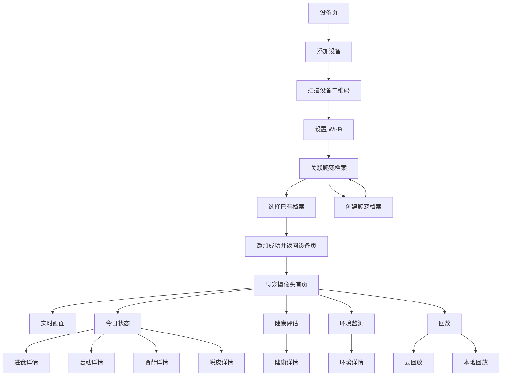

# 爬宠摄像头产品需求文档（PRD）

> 文档版本：V1.0  
> 文档状态：基于当前交互原型整理，可进入产品评审  
> 编制日期：2026-07-15  
> 适用范围：宠智灵 App 中爬宠摄像头的添加、配网、档案关联、实时监控、AI 分析、健康评估、环境监测、告警和回放链路  

---

## 1. 文档目的

本文档将当前原型中已呈现的爬宠摄像头能力整理为可研发、可测试、可验收的完整产品需求，统一产品、设计、客户端、服务端、算法、硬件、测试与运营团队对以下事项的理解：

- 用户如何添加并配置一台爬宠摄像头；
- 摄像头如何与爬宠档案关联；
- 用户如何查看实时画面、设备状态、AI 行为识别与环境数据；
- 用户如何查看进食、饮水、活动、晒背、蜕皮、健康和环境详情；
- 用户如何使用云回放、本地回放与设备会员；
- 系统如何处理设备离线、无数据、识别异常、环境异常、权限失败等边界情况；
- 产品后续如何分阶段从交互原型演进为可商用能力。

## 2. 产品概述

### 2.1 产品定位

爬宠摄像头是面向爬行动物饲养者的智能看护设备。产品以视频监控为基础，以 AI 行为识别、环境传感、健康评估和异常提醒为核心增值能力，帮助用户在不持续守在饲养箱旁的情况下了解宠物状态，并对潜在风险及时采取措施。

### 2.2 用户痛点

1. 爬宠行为安静、异常表现隐蔽，主人难以通过短时间观察发现变化。
2. 进食、饮水、晒背、活动、蜕皮具有明显的时间规律，人工记录成本高且容易遗漏。
3. 热区、冷区、湿度对爬宠健康影响大，但普通摄像头无法将环境数据与行为状态结合分析。
4. 用户离家后无法确认宠物是否正常活动，也缺少关键事件的可追溯录像。
5. 通用宠物健康建议缺少品种、年龄、环境和连续行为数据支撑，针对性不足。

### 2.3 产品目标

- 让首次使用者能够顺利完成“扫码—配网—关联档案—开始看护”的闭环。
- 为用户提供低延迟、稳定、可全屏查看的实时监控体验。
- 自动沉淀进食、饮水、活动、晒背、蜕皮和环境变化记录。
- 将视频行为、宠物档案和环境数据融合为易理解的状态解读与健康评分。
- 在环境或健康风险发生时，以站内提醒和系统推送触达用户。
- 通过云回放、事件留存等设备会员权益建立商业化路径。

### 2.4 成功指标

| 指标类别 | 指标 | 建议目标 |
| --- | --- | --- |
| 添加转化 | 扫码开始至设备添加成功率 | ≥ 85% |
| 配网效率 | 首次添加设备中位耗时 | ≤ 3 分钟 |
| 连接质量 | 在线设备实时预览成功率 | ≥ 98% |
| 连接质量 | 实时画面首帧时间 P95 | ≤ 3 秒 |
| AI 使用 | 摄像头周活用户中 AI 详情页访问率 | ≥ 40% |
| 留存 | 设备绑定用户次月留存率 | ≥ 60% |
| 告警价值 | 高风险告警送达成功率 | ≥ 99% |
| 商业化 | 回放页到设备会员购买页点击率 | 持续观测，首期目标 ≥ 8% |

### 2.5 非目标

- 本产品不替代兽医诊断、处方或急救建议。
- 首期不支持通过摄像头远程控制加热灯、喷淋器等第三方设备；仅提供监测和建议。
- 首期不承诺对所有爬宠品种提供同等准确率，算法支持范围需以白名单为准。
- 当前原型中的数值为示例数据，不代表最终算法阈值或医学标准。

## 3. 用户与使用场景

### 3.1 目标用户

| 用户类型 | 特征 | 核心诉求 |
| --- | --- | --- |
| 新手饲养者 | 对品种习性和环境要求了解有限 | 快速配置、获得清晰建议、及时规避风险 |
| 进阶饲养者 | 有稳定饲养方案，关注长期规律 | 精细数据、趋势、事件录像和自定义阈值 |
| 经常外出用户 | 无法持续现场观察 | 实时查看、异常推送、云端关键片段留存 |

### 3.2 核心场景

1. 用户购买摄像头后，在 App 内扫码并完成 Wi-Fi 配网。
2. 用户将摄像头关联到已有的绿鬣蜥档案，或现场创建新档案。
3. 用户离家时打开实时画面，确认设备在线及宠物当前状态。
4. 用户查看今天是否进食、饮水、活动和晒背，并回看对应事件画面。
5. 用户通过蜕皮时间线判断当前周期是否正常。
6. 用户接收到热区温度偏高提醒，进入环境详情查看趋势和处理建议。
7. 用户查看健康评分、四维分析及近 7 日趋势。
8. 用户通过 TF 卡查看本地录像，或开通设备会员查看云端录像。

## 4. 产品范围与页面清单

### 4.1 本期页面

| 模块 | 页面/状态 | 说明 |
| --- | --- | --- |
| 设备入口 | 设备页—摄像头设备卡片 | 设备筛选、添加入口、爬宠摄像头在线卡片 |
| 添加设备 | 扫码添加设备 | 扫描设备背面二维码 |
| 添加设备 | 设置 Wi-Fi | 网络名称、密码、记住密码、切换网络 |
| 添加设备 | 关联爬宠档案 | 空状态、已有档案单选、新建档案 |
| 添加设备 | 创建爬宠档案 | 头像、昵称、品种、出生日期、年龄、性别 |
| 实时看护 | 爬宠摄像头首页 | 实时画面、今日状态、健康评估、环境监测 |
| 视频回放 | 回放页 | 云回放、本地回放、播放控制、会员权益 |
| 行为详情 | 进食详情 | 进食/饮水汇总、AI 分析、事件列表 |
| 行为详情 | 活动详情 | 时长、次数、AI 分析、活动事件 |
| 行为详情 | 晒背详情 | 时长、次数、AI 分析、晒背事件 |
| 行为详情 | 蜕皮详情 | 当前状态、周期、预测、历史时间线 |
| 健康详情 | 健康详情 | 综合评分、趋势、四维模型 |
| 环境详情 | 环境详情 | 24h 趋势、适宜度、环境变化日志 |
| 消息承接 | 消息—设备告警/健康管理 | 告警与健康消息的集中承接入口 |

### 4.2 信息架构与主流程

### 4.3 通用导航规则

- 所有二级页面左上角提供返回按钮，并返回到明确的上一级页面。
- 实时页与回放页可通过画面下方分段控件双向切换。
- 行为、健康、环境详情页返回实时页，并尽量恢复用户离开前的滚动位置。
- 添加设备流程中返回层级依次为：创建档案 → 关联档案 → Wi-Fi 设置 → 扫码 → 设备页。
- 系统返回手势和实体返回键应遵循相同层级；存在弹窗时优先关闭弹窗。
- 消息页从任意主页面进入后，返回原页面而非固定首页。

## 5. 核心业务对象与状态

### 5.1 业务对象

| 对象 | 核心字段 |
| --- | --- |
| 用户 | 用户 ID、会员状态、通知权限、隐私授权版本 |
| 设备 | 设备 ID、型号、序列号、名称、固件版本、绑定用户、在线状态、网络质量、安装位置、TF 卡状态 |
| 爬宠档案 | 档案 ID、昵称、头像、物种/品种、出生日期、推算年龄、性别、创建人 |
| 设备档案关系 | 设备 ID、档案 ID、关联时间、当前有效状态 |
| 行为事件 | 事件 ID、类型、开始/结束时间、置信度、截图/片段、区域、来源设备 |
| 环境采样 | 采样时间、热区温度、冷区温度、湿度、传感器状态 |
| 健康评估 | 日期、综合分、维度分、风险标签、解释、输入数据完整度、模型版本 |
| 录像文件 | 文件 ID、来源（云/TF）、开始/结束时间、大小、缩略图、事件标签、可访问期限 |
| 告警 | 告警 ID、类型、等级、触发值、阈值、发生时间、状态、处置建议、关联录像 |

### 5.2 状态定义

**设备状态**：未绑定、配网中、在线、弱网、离线、升级中、故障。  
**环境数据状态**：未安装配件、配件离线、数据采集中、数据正常、存在异常。  
**AI 数据状态**：分析中、有结果、无事件、置信度不足、服务异常、数据不足。  
**录像状态**：无 TF 卡、TF 卡正常、TF 卡将满、TF 卡异常；无云会员、会员有效、会员到期、云录像处理中。  
**告警状态**：新告警、已读、已忽略、已恢复；高风险告警恢复后仍须保留历史记录。

## 6. 功能性需求

### 6.1 设备页与摄像头入口

#### FR-DEV-001 设备分类与展示

- 设备区域支持“全部、智能项圈、摄像头”分类。
- 选择“摄像头”时仅展示摄像头类设备；选择“全部”时展示所有设备。
- 每张摄像头卡片至少展示设备名称、安装位置和在线状态。
- 在线、离线、弱网、升级中、故障状态应使用文字与视觉标识共同表达，不得只依赖颜色。
- 多设备时按“异常设备优先、最近使用优先”排序；用户后续可自定义排序。

#### FR-DEV-002 进入设备

- 点击“爬宠摄像头”卡片进入该设备实时监控页。
- 进入时携带设备 ID 与关联档案 ID。
- 若设备离线，仍可进入页面查看历史数据和回放，但实时画面显示离线状态与排查入口。
- 若设备未关联档案，进入后提示关联档案；AI 专属分析在关联完成前不可用。

#### FR-DEV-003 添加设备入口

- 点击设备区域右侧“+”进入扫码添加设备页。
- 若用户未授予相机、局域网、蓝牙或定位权限，系统应按设备配网方案在需要时解释用途并申请，不应在进入页面时一次性索取无关权限。

### 6.2 扫码添加设备

#### FR-ADD-001 扫码识别

- 页面显示扫码取景框及提示：“扫描设备背面二维码”“请将手机尽量靠近要添加的设备”“保持设备开机并电量充足”。
- 识别成功后解析设备型号、序列号和配网凭证，并校验是否为支持的设备。
- 连续识别期间同一二维码只处理一次，避免重复跳转。
- 支持打开手电筒、从相册识别二维码、手动输入序列号作为正式版补充能力。

#### FR-ADD-002 扫码异常

| 异常 | 产品处理 |
| --- | --- |
| 相机权限被拒绝 | 展示权限说明及“前往设置”“手动输入” |
| 二维码模糊/无效 | 保留扫码页并提示重新对准 |
| 非本产品二维码 | 提示“不支持此设备” |
| 设备已被本人绑定 | 提供“查看设备”入口 |
| 设备已被他人绑定 | 提示先由原管理员解绑，禁止覆盖绑定 |
| 设备型号停产或不兼容 | 告知支持范围并提供客服入口 |
| 网络不可用 | 提示检查手机网络，允许重试 |

### 6.3 Wi-Fi 配网

#### FR-WIFI-001 网络信息输入

- 页面展示当前 Wi-Fi 名称、密码输入框、“切换网络”“记住 Wi-Fi 名称和密码”选项及“下一步”。
- SSID 可自动读取时预填；无法读取时允许手动输入。
- 提供清空 SSID 功能。
- 密码默认隐藏，点击眼睛图标切换显示/隐藏，并同步无障碍状态说明。
- “记住 Wi-Fi 名称和密码”默认可勾选；敏感信息必须使用系统安全存储，禁止明文保存或记录到日志。
- 应明确设备支持的频段。若硬件仅支持 2.4GHz，检测到 5GHz 或双频合一导致失败时，应给出可操作指引。

#### FR-WIFI-002 表单校验

- SSID 必填，长度及字符规则按硬件协议校验。
- 密码是否必填由网络加密类型决定；加密网络必须输入密码。
- 输入不合法时，“下一步”不可提交或在提交后就近展示错误原因。
- 清空 SSID 后焦点回到输入框。

#### FR-WIFI-003 配网过程

- 点击“下一步”后进入明确的连接进度状态，至少包含：发送网络信息、设备联网、设备注册、绑定账户。
- 配网过程禁止重复提交，可取消但需二次确认。
- 成功后进入“关联爬宠档案”。
- 配网失败时保留已输入信息，展示失败阶段、可能原因、重试和重新扫码入口。
- 客户端、云端与设备端均需保证绑定操作幂等，避免产生重复设备记录。

### 6.4 关联爬宠档案

#### FR-PROFILE-001 档案列表

- 页面仅展示爬宠类档案，卡片展示头像、昵称、品种、年龄和性别。
- 当前设备仅可单选一个主档案；选中状态需有勾选和 `aria-pressed` 等可访问状态。
- 选中有效档案后“完成”按钮可用；未选择时按钮禁用。
- 点击“完成”写入设备—档案关系，成功后返回设备页并展示新设备卡片。
- 绑定失败时保留选择并允许重试。

#### FR-PROFILE-002 空状态与新增入口

- 无爬宠档案时显示空状态和“创建爬宠档案”主按钮。
- 有档案时列表末尾保留“添加爬宠档案”卡片。
- 从创建页返回后，若创建成功，新增档案自动出现在列表并默认选中。

### 6.5 创建爬宠档案

#### FR-PROFILE-003 基础字段

| 字段 | 规则 |
| --- | --- |
| 头像 | 可拍照或从相册选择；支持预览、重新选择；上传失败可重试；非必填时使用默认头像 |
| 宠物昵称 | 必填；去除首尾空格；建议 1–20 个字符；过滤不可见字符 |
| 品种 | 必填；当前原型包含绿鬣蜥、豹纹守宫、睫角守宫、其他品种 |
| 拍照识别品种 | 调用相机/相册，返回候选品种和置信度；用户最终确认，不可静默写入 |
| 其他品种名称 | 选择“其他品种”后出现并变为必填；切换离开后清空 |
| 出生日期 | 必填；不得晚于当天；按本地日期计算年龄 |
| 年龄展示 | 小于 1 个月显示“不足 1 个月”；否则显示“X 岁 Y 个月” |
| 性别 | 单选：弟弟、妹妹、未知；默认值应由产品确认，建议默认“未知”避免误录 |

#### FR-PROFILE-004 保存与关联

- 点击“保存并关联”前完成字段校验。
- 保存过程展示加载状态并防止重复提交。
- 创建成功后返回关联页、新档案默认选中；用户仍需点击“完成”确认设备关联，或在文案中明确已自动关联。
- 若档案创建成功但设备关联失败，不得回滚已创建档案，应提示用户重新完成关联。

### 6.6 实时监控

#### FR-LIVE-001 实时画面

- 页面顶部展示设备名称，主体首屏展示实时视频。
- 视频区域显示在线/离线/弱网状态。
- 在线时自动拉流；离开页面或 App 进入后台后按平台规则暂停视频，返回时恢复。
- 首帧加载前显示加载占位；超时后提供重试。
- 支持清晰度切换，至少包含流畅、标清、高清；根据网络质量推荐默认档位。
- 支持全屏，横竖屏切换后保持播放状态与清晰度。
- 支持实时/回放模式切换。
- 摄像头隐私模式、设备升级、多人观看上限、弱网重连等状态均需给出明确反馈。

#### FR-LIVE-002 AI 实时分析叠层

- 画面可显示“AI 实时分析”、识别品种和实时状态，例如“绿鬣蜥、晒背中”。
- 仅在置信度达到阈值且用户开启 AI 分析时展示确定性结果。
- 置信度不足时显示“识别中”或不展示，不得输出误导性结论。
- AI 结果应标注为辅助判断；出现服务异常时不影响视频观看。
- 用户应可在设备设置中关闭画面 AI 叠层和对应分析上传。

#### FR-LIVE-003 设备状态与故障处理

| 状态 | 画面与操作 |
| --- | --- |
| 在线 | 正常播放，展示网络质量 |
| 弱网 | 降低默认清晰度，提示可能卡顿，可手动重连 |
| 离线 | 显示最后在线时间、排查步骤、重新连接；保留回放入口 |
| 隐私模式 | 不拉流，说明由谁/何时开启及关闭入口（有权限时） |
| 固件升级中 | 显示进度，禁用实时视频，升级完成后自动恢复 |
| 服务异常 | 区分设备离线与云服务异常，提供重试和客服诊断码 |

### 6.7 今日状态与 AI 状态解读

#### FR-AI-001 状态总览卡片

- 展示四项核心指标并提供详情入口：
  - 进食识别：最近一次进食时间；
  - 活动分析：今日累计活动时长；
  - 晒背识别：今日累计晒背时长；
  - 蜕皮检测：当前是否检测到蜕皮行为。
- 无事件时显示“今日暂未检测到”，不得用 `0` 造成传感器正常但未发生事件与数据缺失混淆。
- 数据采集中、设备离线、算法不可用应分别展示。
- 指标卡数据以用户所在时区的自然日统计，并展示最近更新时间。

#### FR-AI-002 活动区域

- 使用九宫格热力图展示宠物在画面不同区域的活跃程度。
- 提供自然语言摘要，例如“今日活动集中在右侧区域”。
- 摄像头位置改变或画面遮挡时，应触发区域重新校准或暂停跨日对比。
- 用户可查看统计口径，热力图不得被解释为精确物理坐标。

#### FR-AI-003 AI 状态解读

- 综合当日进食、饮水、活动、晒背、蜕皮与档案信息生成摘要。
- 建议必须区分事实、趋势和建议，例如先说明检测结果，再说明“建议提供新鲜叶菜、按需补钙并保证 UVB”。
- 数据缺项时明确说明依据不足，不得生成完整健康结论。
- 所有健康建议附“仅供日常养护参考，异常时咨询专业兽医”提示。

### 6.8 健康评估

#### FR-HEALTH-001 首页健康卡

- 展示综合健康评分、等级和简短结论。
- 展示四个维度：活力指数、进食规律、环境适应、体态健康。
- 原型示例分数分别为 88、90、92、95，综合评分为 95；正式数据由服务端返回。
- 未安装环境监测配件时，“环境适应”显示“需添加环境监测配件后评估”，不得使用伪造分数参与综合评分。
- 卡片支持点击和键盘确认进入健康详情。

#### FR-HEALTH-002 风险识别与建议

- 展示疾病风险识别结果，如“未检测到任何疾病风险”。
- 若发现风险，展示风险等级、可观察表现、建议行动和关联事件，不直接下医学诊断。
- 高风险结果应触发健康管理消息；紧急风险需提供就医提示。
- “未检测到风险”只表示当前可见数据未发现异常，需明确不等于排除疾病。

### 6.9 环境监测与告警

#### FR-ENV-001 无环境数据状态

- 未添加环境配件时显示“暂无环境数据”和配件价值说明。
- 提供“添加环境监测配件”入口（正式版补齐），进入兼容配件添加流程。
- 无配件时环境指标不可点击，健康评分不使用环境维度。

#### FR-ENV-002 有环境数据状态

- 展示热区温度、冷区温度和湿度，包含当前值、单位与适宜状态。
- 首页示例：热区 32.4℃、冷区 26.1℃、湿度 68%；正式数值取最新有效采样。
- 点击任一有效指标进入环境详情。
- 显示 AI 环境解读，结合档案品种的适宜区间，而非使用全品种统一阈值。
- 传感器数据超过有效期时标记“数据已过期”，不可继续显示为“适宜”。

#### FR-ENV-003 环境异常

- 环境异常状态同步改变指标标签、数值样式、AI 解读和顶部通知卡。
- 原型异常示例：热区 38℃，高于绿鬣蜥适宜范围，建议检查加热设备和温控设置。
- 通知卡支持关闭；关闭仅影响当前页面展示，不应删除告警记录或阻止同一风险升级后再次提醒。
- 告警应根据连续超限而非单次毛刺触发，并设置滞回区间防止频繁反复。
- 告警恢复后生成恢复消息，并保留开始时间、峰值、持续时间和恢复时间。

#### FR-ENV-004 通知触达

- 环境告警进入消息中心“设备告警”，健康风险进入“健康管理”。
- 支持站内消息和系统推送；高风险告警默认推送，普通变化可由用户配置。
- 消息点击后进入对应设备和日期的环境/健康详情，并定位到相关事件。
- 用户可标记已读、批量清除未读状态；清除未读不删除消息历史。

### 6.10 回放

#### FR-PLAY-001 通用播放控制

- 回放页顶部保留设备名称和视频区域。
- 支持播放/暂停、倍速、全屏、实时/回放切换。
- 倍速建议支持 0.5×、1×、1.5×、2×、4×；默认 1×。
- 切换录像文件后更新画面、标题、当前时间、总时长和播放进度。
- 播放失败时区分文件损坏、网络失败、权限过期和文件已删除。
- AI 实时叠层在回放模式下应改为“录像事件信息”或隐藏，避免误称实时分析。

#### FR-PLAY-002 云回放

- 未开通会员时展示设备会员权益和“开通会员”入口。
- 原型权益包括：云端保护、隐私加密、超大空间、事件推送。
- 购买页须说明套餐价格、保存天数、绑定设备数、自动续费规则、退款规则和服务到期影响。
- 已开通会员时展示日期轴、事件筛选、云录像列表/时间轴，而不是继续展示购买广告。
- 云端视频传输与存储必须加密；分享、下载、删除需进行权限校验。
- 会员到期后按约定进入保留期，明确提示数据删除日期。

#### FR-PLAY-003 本地回放

- 展示 TF 卡已用空间和总容量，例如原型中的 42.6G/128G。
- 按时间倒序展示录像缩略图、开始时间和文件大小。
- 点击文件后选中并播放；选中状态需明确。
- 支持日期筛选、事件类型筛选、删除、下载（权限允许时）和格式化 TF 卡。
- TF 卡不存在、未格式化、损坏、将满、读取失败时提供相应状态和操作指引。
- 循环录像开启时，应说明旧文件将按时间自动覆盖；被用户锁定的事件片段不参与覆盖。

### 6.11 行为详情页通用能力

#### FR-DETAIL-001 日期选择

- 进食、活动、晒背和环境详情提供周视图，展示周一至周日和日期。
- 点击日期刷新当前页面全部统计、分析和事件。
- 点击日历打开月份选择弹窗，支持上月、下月、选择日期和“今天”。
- 未来日期不可选；超出数据保留期的日期需说明原因。
- 所有详情页的日期选择状态应彼此独立，避免在一个页面切换后意外改变其他页面。
- 当前原型共用日期状态的实现仅用于演示，正式版需按页面/设备/档案管理查询条件。

#### FR-DETAIL-002 事件列表

- 事件按时间倒序展示时间、类型、描述和缩略图（有画面时）。
- 点击事件进入对应时间点的录像；有云/本地双来源时优先使用可访问来源。
- 低置信度事件允许用户反馈“识别正确/错误”，为算法迭代提供样本。
- 无事件、分析中、数据不足、设备离线应有不同空状态。

#### FR-DETAIL-003 AI 分析结构

- 每个详情页统一呈现“品种习性—今日数据—分析结论—建议”。
- 结论状态至少包含：正常、需关注、异常、数据不足。
- 分析展示生成时间和依据的数据范围；模型更新后保留历史结果版本。

### 6.12 进食与饮水详情

#### FR-FOOD-001 当日汇总

- 展示最近一次进食时间、今日进食次数、最近一次饮水时间、今日饮水次数。
- 原型示例：11:45 最近进食、今日 1 次；13:20 最近饮水、今日 2 次。
- 跨午夜事件按事件开始时间归属自然日；持续事件需避免重复计数。

#### FR-FOOD-002 饮食分析与事件

- 结合品种说明日常习性；绿鬣蜥示例为“通常每日进食 1 次、以日间为主，饮水无固定次数并保持全天清洁饮水”。
- 输出当日状态，例如“进食与饮水表现正常”。
- 分别记录进食和饮水事件，包含时间、行为描述和识别画面。
- 连续多帧识别应合并为一个事件，合并间隔由算法配置。

### 6.13 活动详情

#### FR-ACT-001 活动统计

- 展示当日累计活动时长和活动次数。
- 原型示例：1 小时 20 分钟、6 次。
- 活动定义、最短事件时长、相邻事件合并规则必须由算法和产品共同确定并可版本化。

#### FR-ACT-002 活动分析与事件

- 根据爬宠日行/夜行习性、光照、温度和历史基线判断是否正常。
- 展示活动事件时间、所在画面区域和缩略图。
- 对“显著少于个体基线”“异常持续运动”“昼夜节律改变”等情况生成需关注提示。

### 6.14 晒背详情

#### FR-SUN-001 晒背统计

- 展示当日晒背时长和次数；原型示例为 42 分钟、3 次。
- 晒背识别应结合热区位置、姿态、时间和光照条件，避免将普通静止误判为晒背。

#### FR-SUN-002 晒背分析与事件

- 展示品种晒背习性、UVB 相关养护说明、当日结论及事件列表。
- 结论不得仅依据时长，应结合环境温度、灯具状态（若可用）和个体历史基线。
- 过长、过短或持续远离热区时可触发关注提示，但需给出数据依据。

### 6.15 蜕皮详情

#### FR-MOLT-001 当前状态与周期

- 展示当前蜕皮状态、上次蜕皮距今天数、平均周期和下次预计日期。
- 原型示例：未蜕皮、上次 14 天前、平均周期 28 天、预计 7 月 21 日。
- “预计日期”为概率预测，需标注预计范围或可信度，不应表现为确定发生日。

#### FR-MOLT-002 蜕皮历史与分析

- 以时间线展示蜕皮开始、完成、持续天数和两次周期的间隔。
- 原型示例包含 05/18–05/24、06/17–06/23 两个周期。
- 结合物种、年龄、历史周期和湿度判断节奏是否正常。
- 检测到残皮、蜕皮时间过长或伴随异常行为时，生成需关注提示和护理建议。
- 用户应可手动补录、修正开始/完成日期，以应对算法漏检。

### 6.16 健康详情

#### FR-HEALTH-003 综合评分与趋势

- 展示综合分、等级、较昨日变化和近 7 日趋势。
- 综合分必须基于可解释的维度权重；缺失维度时重新归一化或显示数据不足，不得将缺失视为满分。
- 趋势图支持读出每个日期的实际分值，并对异常下降提供原因入口。

#### FR-HEALTH-004 四维模型

- 活力指数子项：活动时长、活动频次、昼夜规律。
- 进食规律子项：进食频次、进食间隔、进食稳定性。
- 环境适应子项：温度、湿度、区域利用。
- 体态健康子项：体表健康、姿态健康、健康稳定性。
- 每个维度展示分数、子项分数、解释和数据完整度。
- 健康模型版本、阈值变更应可追溯，避免同一历史日期因模型升级无提示地改变。

### 6.17 环境详情

#### FR-ENV-005 24 小时趋势

- 展示所选日期的热区温度、冷区温度和湿度当前值及 24 小时趋势。
- 趋势图支持图例、单位、时间轴、触点读值、异常区间和数据缺口。
- 原型中的绿鬣蜥适宜范围为热区 29–33℃、冷区 24–27℃、湿度 60%–85%；正式阈值由品种知识库、专家审核和用户配置共同决定。

#### FR-ENV-006 环境适宜度与变化日志

- 展示品种适宜环境、当日整体适宜度和自然语言结论。
- 环境变化日志展示时间、指标变化、是否仍在范围内、异常建议。
- 原型日志示例包括：冷区降至 25.5℃、热区升至 32.5℃、热区达到 38℃。
- 点击异常日志可跳转对应时间点录像，辅助判断宠物行为反应。

### 6.18 消息中心承接

#### FR-MSG-001 消息分类与未读

- 消息中心至少包含“设备告警”和“健康管理”两类摄像头相关消息。
- 分类展示未读数；支持单条已读、全部已读和按分类筛选。
- “清除未读”只改变阅读状态，不删除消息和事件数据。
- 无消息时展示空状态。

#### FR-MSG-002 消息内容

- 消息包含设备名称、关联宠物、告警类型、等级、发生时间、摘要和处理状态。
- 点击消息深链到对应设备、日期和事件。
- 同一持续异常应聚合更新，避免重复轰炸；风险升级时允许再次强提醒。

### 6.19 设备设置（正式版必需补齐）

当前原型未提供设备设置页，但完整产品闭环必须具备：

- 修改设备名称和安装位置；
- 查看设备 ID、型号、固件版本、网络信息和最后在线时间；
- 修改 Wi-Fi、重启设备、固件升级；
- 开关状态灯、夜视、声音、画面翻转、水印、AI 叠层；
- 配置录像模式、TF 卡状态、格式化、循环录像；
- 配置环境/健康告警阈值与免打扰时段；
- 分享设备与家庭成员权限管理；
- 隐私模式、数据导出、解绑和删除设备。

## 7. 业务规则与算法口径

### 7.1 数据优先级

1. 实时值使用最新有效采样，并展示采样时间。
2. 日统计以设备所属用户时区的 00:00–23:59 为周期。
3. AI 分析以设备—档案关系生效时间为边界，不将关联前数据错误归因到当前宠物。
4. 设备更换档案后，历史事件仍归属原档案；新数据归属新档案。
5. 摄像头画面同时出现多只宠物时，无法可靠归属的事件标记“待确认”，不得自动计入个体健康评分。

### 7.2 AI 结果规则

- 每项结果必须携带模型版本、置信度、输入数据时间范围和数据完整度。
- 低于展示阈值的事件不进入用户统计；处于灰区的事件可进入“待确认”。
- 用户纠错不立即改写原始模型结果，而是形成更正记录并重新计算派生统计。
- 医疗风险类结果采用保守文案：“疑似”“需关注”“建议咨询专业兽医”，禁止输出确定诊断。
- 算法服务不可用时，基础监控和回放仍应可用。

### 7.3 环境阈值规则

- 默认阈值来自品种知识库，并允许进阶用户在安全范围内自定义。
- 告警触发需满足“超阈值幅度 + 持续时间”；不同等级可配置不同条件。
- 恢复阈值与触发阈值应设置滞回，防止临界值反复告警。
- 传感器离线、漂移或读数突变应触发设备类告警，而非直接输出宠物环境异常。

### 7.4 健康评分规则

- 综合评分建议采用 0–100 分，并映射为优秀、良好、需关注、异常、数据不足。
- 权重需经过专家评审和离线验证，并向用户提供简化解释。
- 当日有效观测时长不足、设备离线时间过长或关键维度缺失时，应降低可信度或不给分。
- 历史趋势默认冻结当日模型结果；如需按新模型回算，必须标识模型变更。

## 8. 权限、隐私与安全

### 8.1 权限设计

- 相机：扫码、拍摄宠物头像、拍照识别品种。
- 相册：选择二维码、头像和品种识别照片。
- 局域网/蓝牙/定位：仅在设备发现或配网协议实际需要时申请。
- 通知：首次产生高价值提醒前，以前置说明申请；拒绝后保留站内消息并提供设置入口。
- 权限拒绝后，提供替代路径，不以空白页或死链结束流程。

### 8.2 隐私安全

- 实时视频、录像、截图、Wi-Fi 密码和宠物健康数据属于敏感数据，传输与存储必须加密。
- Wi-Fi 密码不上传业务日志；客户端使用系统安全存储。
- 设备分享采用最小权限，区分管理员、可查看实时、可查看回放、仅接收告警等角色。
- 视频访问、下载、删除、分享、解绑均记录安全审计日志。
- 用户可查看数据用途、保存期限、第三方处理方，并可申请导出或删除数据。
- 默认禁止将家庭视频用于模型训练；若需使用，必须单独、明确、可撤回地授权。

## 9. 非功能性需求

### 9.1 性能与稳定性

- 页面可交互时间 P95 ≤ 2 秒（不含视频首帧）。
- 实时视频首帧 P95 ≤ 3 秒，弱网下 ≤ 8 秒并给出进度反馈。
- 设备在线状态变化到 App 可见的延迟 P95 ≤ 10 秒。
- 高等级环境告警从服务端判定到系统推送送达 P95 ≤ 30 秒。
- 核心服务月可用性目标 ≥ 99.9%；视频和 AI 服务故障相互隔离。
- 配网、绑定、会员购买、设备解绑等关键写操作必须幂等。

### 9.2 兼容与可访问性

- 支持产品定义的最低 iOS、Android 版本及主流屏幕尺寸。
- 深色模式若未完整设计，应固定浅色主题，避免系统强制反色导致不可读。
- 所有可点击元素具备可访问名称、足够触控尺寸和焦点态。
- 状态与告警不得只用颜色传达；图表提供文字摘要。
- 字体放大后核心信息和主按钮不得截断。

### 9.3 可观测性

- 记录配网阶段、错误码、设备型号、固件版本和网络类型，但不记录密码及视频内容。
- 关键链路具备端到端 trace ID，方便定位设备端、客户端、云端问题。
- 算法结果监控覆盖识别量、置信度分布、用户纠错率、漏报/误报抽检。

## 10. 埋点与数据分析

| 事件 | 关键属性 |
| --- | --- |
| `device_add_entry_click` | 来源页面、已有设备数 |
| `device_qr_scan_result` | 成功/失败、设备型号、失败原因；不得上传二维码原文 |
| `wifi_setup_submit` | 频段、加密类型、是否记住密码、结果、耗时；不得上传 SSID/密码 |
| `device_bind_result` | 设备型号、档案是否新建、结果、错误码 |
| `camera_live_open` | 设备状态、首帧耗时、默认清晰度 |
| `camera_quality_change` | 原档位、目标档位、网络类型 |
| `camera_playback_open` | 云/本地、会员状态、来源 |
| `cloud_membership_click` | 权益位、套餐、设备 ID 哈希 |
| `ai_metric_open` | 进食/活动/晒背/蜕皮/健康/环境、日期 |
| `ai_event_feedback` | 事件类型、正确/错误、模型版本 |
| `environment_alert_received` | 等级、指标、前后台、送达延迟 |
| `environment_alert_open` | 入口、打开耗时、是否查看录像 |
| `detail_date_change` | 页面类型、日期跨度、数据是否存在 |

埋点需遵循隐私最小化原则，设备 ID、用户 ID 采用内部脱敏标识，不上传视频帧、Wi-Fi 信息或可直接识别家庭环境的内容。

## 11. 异常与空状态总表

| 场景 | 必要反馈 | 可用操作 |
| --- | --- | --- |
| 无摄像头设备 | 展示产品价值和添加引导 | 添加设备 |
| 扫码权限拒绝 | 说明权限用途 | 前往设置、手动输入 |
| 配网失败 | 展示失败阶段和错误原因 | 重试、切换网络、重新扫码 |
| 无爬宠档案 | 明确需先创建档案 | 创建档案 |
| 设备离线 | 最后在线时间和排查建议 | 重连、查看回放、设备诊断 |
| 视频加载失败 | 区分网络、权限、服务异常 | 重试、切换清晰度 |
| 当日无 AI 事件 | 明确“未检测到”而非“无数据” | 查看其他日期 |
| AI 服务异常 | 基础视频仍可用 | 重试、稍后查看 |
| 无环境配件 | 说明能力缺失原因 | 添加配件 |
| 传感器离线 | 显示最后数据时间，停止适宜判断 | 检查配件 |
| 环境异常 | 显示指标、幅度、持续时间和建议 | 查看详情、查看录像、关闭当前提示 |
| 无 TF 卡 | 说明本地回放不可用 | 安装/格式化指引 |
| TF 卡损坏/将满 | 明确风险 | 格式化、清理、开启循环录像 |
| 无云会员 | 展示权益与规则 | 开通会员 |
| 云录像过期 | 显示删除规则 | 购买/续费、查看本地录像 |
| 健康数据不足 | 不输出误导性分数 | 保持设备在线、补充环境配件 |

## 12. 验收标准

### 12.1 添加设备链路

1. 用户从设备页点击添加，可进入扫码页并正常返回。
2. 有效二维码可进入 Wi-Fi 页；无效、已绑定和不支持设备有不同提示。
3. SSID、密码显示切换、清空、记住密码和表单校验符合需求。
4. 配网成功后可选择已有爬宠档案或创建新档案。
5. 新档案字段、年龄计算、“其他品种”和头像预览工作正常。
6. 未选档案时不能完成；选择后完成绑定，设备页出现对应设备卡片。
7. 任一步骤失败均可重试，已输入的非敏感信息按规则保留，不产生重复设备。

### 12.2 实时与 AI 链路

1. 在线设备可拉取实时画面并显示首帧、在线状态和清晰度。
2. 清晰度、全屏、实时/回放切换可用，返回层级正确。
3. 今日四项状态、活动区域和 AI 解读在有数据、无事件、分析中、服务异常时展示不同状态。
4. 各状态卡可进入正确详情页，返回后恢复实时页上下文。
5. 无环境配件时不显示伪造环境分；有配件时可进入环境详情。
6. 环境超限后首页告警、指标状态、AI 解读、消息推送和环境日志一致。

### 12.3 详情与回放链路

1. 日期周视图和月历可选择有效历史日期，未来日期不可选。
2. 进食、活动、晒背、蜕皮、健康、环境页面显示与接口口径一致的数据。
3. 行为事件点击后能定位到有权限访问的对应录像时间点。
4. 本地回放正确显示 TF 卡容量、文件列表、选中态及播放信息。
5. 云会员未开通、已开通、已到期三种状态展示正确内容。
6. 视频、AI、传感器、TF 卡任一服务故障不会导致整个设备页不可用。

### 12.4 安全与合规

1. Wi-Fi 密码不出现在日志、埋点或明文持久化中。
2. 未授权用户无法访问实时视频、回放或健康数据。
3. 录像访问、分享、下载、删除及设备解绑存在审计记录。
4. AI 健康结论不使用确定性诊断文案，并展示适当免责声明。
5. 用户撤回视频分析授权后，新的 AI 分析停止且基础监控仍可使用。

## 13. 依赖与风险

### 13.1 外部依赖

- 摄像头硬件、固件、配网协议与设备云；
- 实时音视频 SDK、P2P/中继和弱网策略；
- TF 卡录像索引与远程读取能力；
- 云存储、设备会员、支付和订阅体系；
- 进食/饮水、活动、晒背、蜕皮、体态和疾病风险算法；
- 温湿度传感器及配件接入；
- 爬宠品种知识库和兽医/爬宠专家审核机制；
- 消息中心、系统推送、用户权限和家庭共享体系。

### 13.2 主要风险与对策

| 风险 | 影响 | 对策 |
| --- | --- | --- |
| 算法误报/漏报 | 降低信任，健康建议可能误导 | 分级阈值、置信度管理、用户纠错、专家抽检、非诊断性文案 |
| 摄像头视角变化 | 区域统计和行为识别失效 | 遮挡/位移检测、重新校准提醒 |
| 多宠同框 | 个体归属错误 | 首期限制单宠箱；无法归属时进入待确认 |
| 传感器漂移 | 错误环境告警 | 异常值过滤、设备自检、校准和传感器故障告警 |
| 弱网/离线 | 实时体验差、数据缺失 | 自适应码率、断点重连、本地缓存、明确数据完整度 |
| 家庭视频隐私 | 合规和信任风险 | 端到端权限控制、加密、审计、最小化采集、训练单独授权 |
| 健康评分过度确定 | 用户将分数误作诊断 | 解释数据依据、可信度、免责声明和就医建议 |
| 会员权益不清 | 投诉和退款风险 | 明示保存天数、价格、续费、到期和删除规则 |

## 14. 产品迭代规划

### 阶段 0：原型收敛与技术预研（2–3 周）

**目标**：冻结信息架构、接口口径和算法支持范围，消除原型与真实能力差距。

- 完成本文档评审，确认页面范围、导航、状态和字段规则。
- 定义设备、档案、行为事件、环境采样、健康评分、录像和告警数据模型。
- 确认扫码/配网协议、2.4GHz 限制、权限需求和错误码。
- 确认实时视频 SDK、TF 卡索引能力、云录像方案与会员边界。
- 确认首批支持品种及各算法的最低准确率、展示阈值和灰度策略。
- 由爬宠专家审核适宜环境、养护建议和风险文案。
- 移除生产版本中的“演示：有/无环境数据、异常状态”开关，改由真实接口状态驱动。

**退出标准**：接口文档、状态机、埋点方案、隐私评估、算法指标和测试方案均通过评审。

### 阶段 1：MVP 设备闭环（6–8 周）

**目标**：让用户能稳定添加、观看和管理一台爬宠摄像头。

- 设备列表、扫码、Wi-Fi 配网、绑定、解绑和基础设备设置。
- 关联/创建爬宠档案，完成字段校验、头像上传和年龄计算。
- 实时画面、在线/离线、弱网重连、清晰度和全屏。
- TF 卡状态、本地录像列表、基础播放/暂停/倍速。
- 基础设备告警：离线、TF 卡异常、固件升级失败。
- 权限、隐私协议、视频访问控制、审计日志和关键埋点。
- 完整异常/空状态及可观测性建设。

**退出标准**：添加成功率 ≥ 85%，实时首帧成功率 ≥ 98%，核心链路无 P0/P1 缺陷，安全评审通过。

### 阶段 2：AI 日常看护（6–10 周，可与阶段 1 后半程并行研发）

**目标**：上线用户最容易理解和验证的行为识别能力。

- 进食/饮水、活动、晒背三类识别及事件合并。
- 今日状态卡、事件列表、周日期选择、录像时间点联动。
- 活动区域九宫格和摄像头位移/遮挡检测。
- AI 状态解读、数据完整度、置信度策略和用户纠错。
- 站内“健康管理”消息的低风险提示。
- 建立线上算法监控、抽检和反馈闭环。

**退出标准**：目标品种和标准安装场景下的算法精度达到约定门槛；用户可理解率和事件纠错率达到灰度目标。

### 阶段 3：环境监测与主动告警（6–8 周）

**目标**：从“看得见”升级为“能及时发现环境风险”。

- 温湿度配件添加、绑定、自检、离线与校准。
- 热区、冷区、湿度实时值和 24h 趋势。
- 品种默认阈值、连续超限、滞回恢复和用户自定义阈值。
- 首页环境卡、异常通知、环境变化日志和录像联动。
- 系统推送、告警聚合、升级、恢复及免打扰配置。
- AI 环境适宜度解读，并纳入健康评分的数据完整度判断。

**退出标准**：高等级告警送达率 ≥ 99%，误告警率达到试点目标，传感器异常不会被误判为环境风险。

### 阶段 4：健康与蜕皮智能（8–12 周）

**目标**：形成连续、可解释、不过度医疗化的健康管理体验。

- 蜕皮开始/完成检测、周期统计、预测范围、历史补录与纠错。
- 体态/姿态/体表异常的研究性能力，先灰度再逐步放量。
- 四维健康模型、近 7 日趋势、数据完整度与模型版本管理。
- 风险分级、健康消息、就医建议和专家审核流程。
- 长期个体基线，识别相对变化而非只使用通用品种阈值。

**退出标准**：健康模型通过专家评审与回顾性验证；高风险提示具备充分依据、可解释且合规。

### 阶段 5：云回放与商业化（6–8 周）

**目标**：以可信、透明的录像权益形成设备会员收入。

- 云录像上传、加密存储、时间轴、事件筛选、下载/分享/删除。
- 未开通、试用、有效、即将到期、已到期、保留期状态。
- 套餐、支付、自动续费、退款、权益恢复和多设备规则。
- 关键事件云端锁定、推送与一键定位。
- 会员转化漏斗、权益使用率和退订原因分析。

**退出标准**：支付与权益一致性通过对账测试；录像保存/删除规则清晰；隐私和安全渗透测试通过。

---

## 附录 A：原型已实现交互与正式产品差距

| 原型能力 | 当前表现 | 正式产品需补齐 |
| --- | --- | --- |
| 页面切换 | 单页前端视图切换 | 路由、参数、状态恢复、鉴权 |
| 扫码 | 点击取景框直接进入下一步 | 相机识别、权限、二维码校验、异常处理 |
| Wi-Fi | 预填示例 SSID/密码，可清空与显隐 | 真正配网、频段检测、安全存储、失败重试 |
| 档案创建 | 本地预览头像、计算年龄、切换字段 | 接口持久化、校验、上传、错误处理 |
| 设备绑定 | 选择后直接返回设备页 | 云端绑定、幂等、进度、失败恢复 |
| 实时视频 | 静态图片模拟 | 实时拉流、弱网、清晰度、全屏、隐私模式 |
| AI 指标 | 固定示例值 | 真实事件、置信度、数据完整度、纠错 |
| 环境状态 | 演示开关切换有/无数据和异常 | 真实传感器、阈值引擎、告警和恢复 |
| 日期切换 | 多页面共享演示日期状态 | 独立查询状态、真实接口、跨月和保留期 |
| 回放 | 标签和文件选中态 | 时间轴、播放进度、文件读取、云会员状态 |
| 消息 | 分类与空状态 | 消息列表、未读、推送、深链和聚合 |

## 附录 B：术语

- **热区**：饲养箱内供爬宠升温、晒背的高温区域。
- **冷区**：饲养箱内温度相对较低、供宠物主动降温的区域。
- **UVB**：有助于部分爬宠维生素 D3 合成和钙代谢的紫外线波段。
- **行为事件**：AI 从连续视频中识别并合并生成的一次进食、饮水、活动、晒背或蜕皮记录。
- **个体基线**：基于同一宠物长期数据形成的正常行为范围。
- **数据完整度**：在给定统计周期内，设备在线、画面可用、传感器有效及算法正常的综合覆盖程度。
- **TF 卡**：安装在设备中的本地存储卡，用于循环录像和本地回放。

